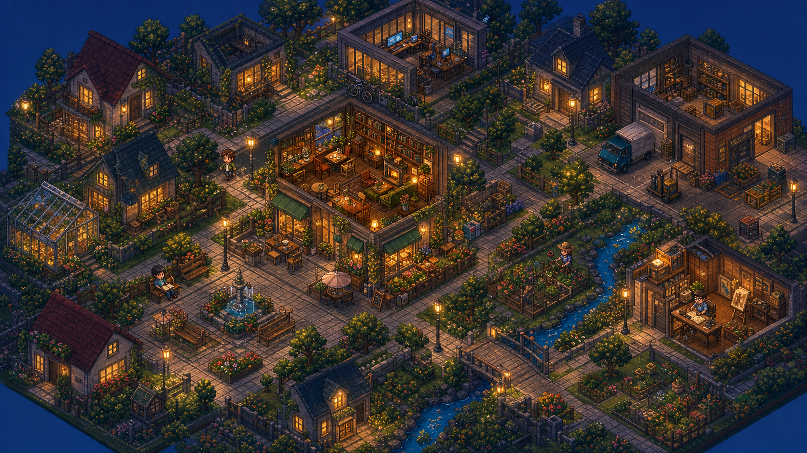
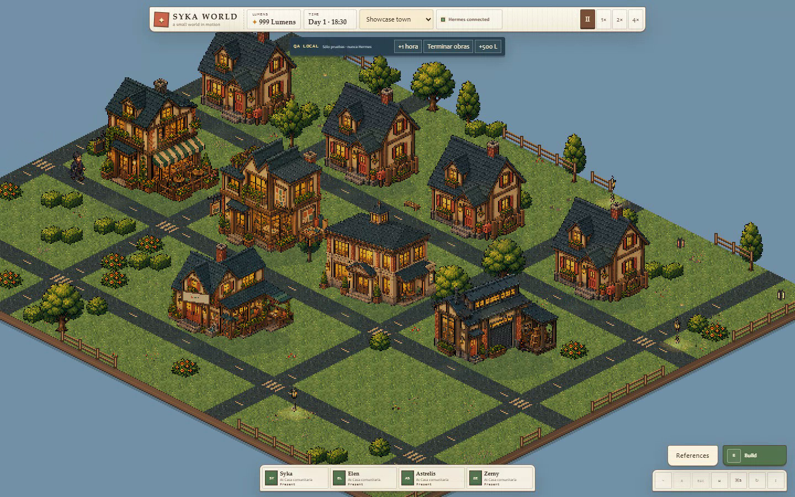
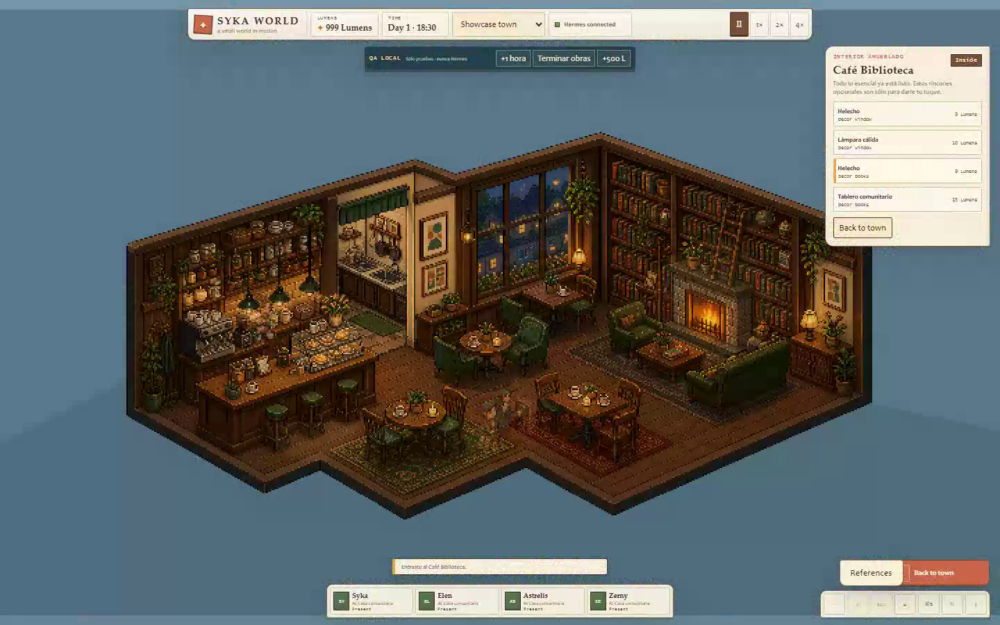
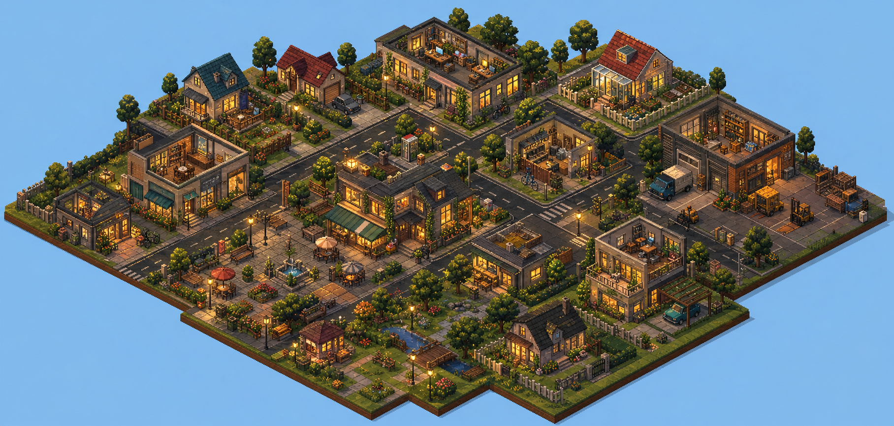
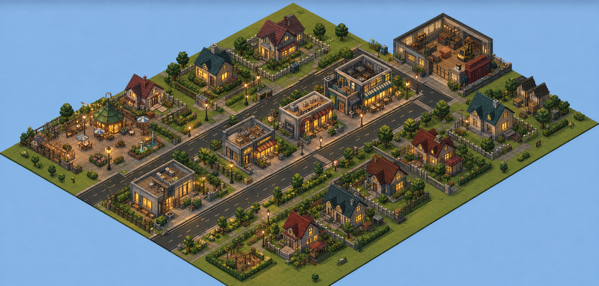
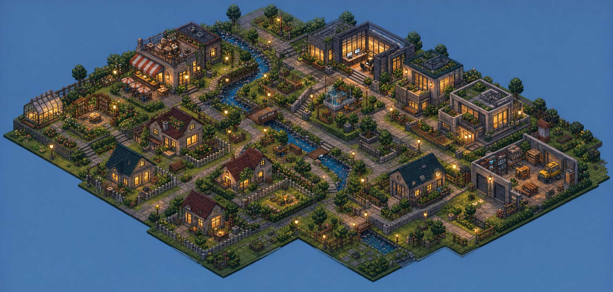
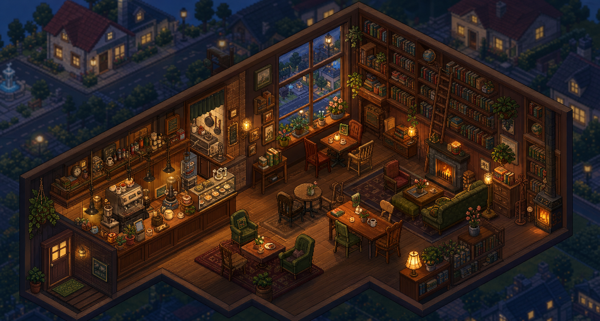

# Syka World



*Future vision concept art — this image communicates the intended atmosphere and density; it is not a gameplay screenshot.*

Syka World is a cozy, fixed-camera, isometric 2.5D town where Hermes AI profiles become visible inhabitants with local routines and truthful visual reactions to real Hermes activity.

> **Alpha status:** this is a playable, incomplete development snapshot published for OpenAI Build Week. Several systems and visual surfaces remain provisional.

The game observes Hermes through a passive, GET-only bridge. When a profile is idle, its world character follows deterministic local routines without consuming LLM tokens. When real work arrives through Hermes, the bridge reflects a privacy-safe activity state and the character visibly transitions into thinking, travelling, working, waiting, completing, or error states.

```text
Hermes → GET-only bridge → local simulation/state → isometric game
```

## See the playable alpha

[](docs/media/syka-world-alpha-tour-v1.mp4)

*Freshly recorded gameplay from the current alpha. Click the preview to open the full MP4 tour.*

| Current city | Current Cafe Library |
|---|---|
|  |  |

These are real captures from the repository build. They show the current visual baseline, including the working city, furnished cafe interior, camera controls and alpha UI.

## Where Syka World is going

The long-term direction is a denser, warmer and more personal world that players can shape around their own Hermes profiles:

- each discovered profile becomes a persistent inhabitant with a home, workplace and recognizable daily life;
- neighborhoods grow through connected buildings, gardens, public spaces and walkable streets;
- real Hermes activity appears as privacy-safe visual states, while ambient routines remain deterministic and local;
- interiors feel complete from the moment a building opens, with optional customization layered on top;
- the town remains calm and readable: a place to understand activity at a glance, not another chat window.

The following approved concept studies define that destination. **They are visual references, not screenshots of completed features.**

| Twilight density and lighting | Main-street structure |
|---|---|
|  |  |
| **Green micro-neighborhoods** | **Cafe Library interior quality** |
|  |  |

## What the alpha includes

- Web client in `app/game`, built with Phaser 4.2.1, TypeScript and Vite;
- Fixed isometric pixel-art camera with pan and 100/150/200% zoom, no rotation;
- Showcase and New Game modes;
- Catalog, Lumens currency, placement, staged construction, upgrades and sector unlocking;
- Shared preview and confirmation plan with vegetation clearing and automatic road connector;
- Construction acceleration (pay Lumens or skip one hour) with idempotent completion XP;
- Day, twilight and night cycle;
- Exterior catalog with nine persistent physical objects, removal and 50% refund;
- Cafe Library with isolated interior, furnished, contextual actions and visible exterior upgrade;
- Four legacy agent placeholders with silhouette-calibrated scale, fluid exterior movement, visible cafe entry and a spatial "Go to Cafe" order;
- Five local NPCs — Alma, Beni, Iara, Milo and Noa — with a runtime atlas, deterministic routines, visible city transit and full separation from Hermes;
- Interior actors with feet, shadows, anchors and real occlusion against bar, tables and sofa;
- Isometric base with earth thickness, grass microtexture and perimeter fences that respect access points;
- Persistent Build CTA and References gallery with four approved concept maquettes;
- Ambient microfauna — sparrows, butterflies and snail — separate from collisions;
- Versioned local save/load;
- GET-only Hermes bridge with online, simulated, degraded and offline modes;
- Local QA mode (`?qa=1`) that accelerates time/construction and never touches Hermes;
- Shared typed spatial runtime between city and cafe: entities, footprints, walk grid, anchors, interactions, portals, occupancy, reservations, collisions and depth;
- Click movement and a 3-second hold on arrival before resuming the autonomous routine;
- Possess mode via button or `P`, cardinal WASD, `E` on the exact anchor and `F` for doors;
- Interior exit without teleport: `Esc` releases first, then routes to the door;
- Cafe furniture preserved as semantic landmarks over the approved raster, with a conservative safe-foot navigation surface;
- Save/load preserves the agent's cell but does not restore an active possession;
- Deterministic depth compositor with elevation, render parts (back/body/front/overlay) and stable tie-breakers;
- Dynamic profile discovery: arbitrary Hermes profile IDs are accepted at runtime instead of four compile-time values;
- Optional Sikora preset (`config/presets/sikora-world.json`) seeds the four legacy characters for existing users;
- Unknown profile events are preserved as discovered-but-unassigned, never attributed to Syka or dropped.

## Dynamic profiles

Syka World no longer hardcodes four profile identities. The public version discovers Hermes profiles at runtime through a `ProfileRegistry`:

```text
Hermes profile discovered at runtime
                 ↓
Persistent configurable world-character binding
```

- `profile_id` is an external Hermes identity represented as a validated string, not a four-value TypeScript union.
- `character_id` is a stable Syka World identity that survives a profile going offline.
- Unknown profile events from the bridge are not dropped — they become discovered-but-unassigned entries until the user maps a character to them.
- The optional Sikora preset seeds `default`, `elen`, `astrelis`, `zerny` for existing saves. A public clone can remove or replace this preset without code changes.

## Characters

The legacy preset maps Hermes profiles to world characters:

| World character | Profile ID | Role |
|---|---|---|
| Syka | `default` | Direction, coordination and creativity |
| Elen | `elen` | Marketing and communication |
| Astrelis | `astrelis` | Commerce and relationships |
| Zerny | `zerny` | Construction and CRM |

These are optional. A public installation discovers profiles dynamically and creates characters through the onboarding flow.

## Opening the game

First install:

```bash
cd "app/game"
npm ci
```

Each time you want to play:

```bash
cd "app/game"
npm run dev
```

Open `http://127.0.0.1:5173/` for the Showcase town or `http://127.0.0.1:5173/?mode=progressive` for New Game. An existing save takes priority; the New Game selector lets you restart with confirmation.

The bridge is optional. If available at `127.0.0.1:8765`, the frontend observes state and events via GET; otherwise local life continues.

### Controlling an agent

1. Click Syka, Elen, Astrelis or Zerny.
2. Click a free tile to make them walk there automatically.
3. Press `P` or the **Possess** button to control them with `W`, `A`, `S` and `D`.
4. Use `E` for a contextual interaction and `F` in front of a door.
5. Press `Esc` to release possession. Inside the cafe, a second `Esc` auto-routes to the door and returns to town.

`B` keeps **Build** available in the city and works as a compatible exit inside the cafe. Game keys are ignored when focus is in an editable field. The full map is in the [runbook](docs/ALPHA_RUNBOOK.md).

## Validation

- frontend: **281/281 tests**;
- typecheck and build: **PASS**;
- Python/bridge/simulation: **39/39 tests**;
- raster clearance gate: **9/9 PASS**;
- Interior Entity & Possession E2E: **14/14 steps PASS** at 1440×900;
- Cafe re-entry regression: **PASS** in a single page and single `Phaser.Game`;
- bridge audit: **8 GET requests, no body, zero writes, zero Hermes tasks**.

## Built with Codex and GPT-5.6

During OpenAI Build Week, Codex and GPT-5.6 were used as an engineering collaborator across the typed spatial runtime, dynamic Hermes profile discovery, deterministic simulation, furniture/depth experiments, regression diagnosis, tests and documentation. The human-led decisions remained the product direction, interaction model, safety boundary, visual approvals and final scope.

The project preserves that collaboration as dated goals, decisions, runbooks and reproducible reports. The most important Build Week additions include dynamic profiles, the shared city/interior spatial contract, direct possession controls, deterministic occupancy and depth, and the same-runtime Cafe re-entry regression fix.

## Main documents

- [Current state](CURRENT_PROJECT_STATE.md)
- [Tasks](TASKS.md)
- [Decisions](docs/DECISIONS.md)
- [Runbook](docs/ALPHA_RUNBOOK.md)
- [Bridge v0.3](docs/BRIDGE_V0_3.md)
- [Vision](docs/VISION.md)
- [Game Design v0.1](docs/GAME_DESIGN_V0_1.md)
- [Visual Style Guide](docs/VISUAL_STYLE_GUIDE.md)
- [Habbo Spatial Public Foundation goal](docs/GOAL_HABBO_SPATIAL_PUBLIC_FOUNDATION_V1.md)
- [NPC atlas provenance](app/game/public/assets/generated/npc-v1/asset-provenance.md)
- [Sikora preset](config/presets/sikora-world.json)

## Current limits

- Avatars/pets are placeholders: they do not fix species, silhouette or final identity.
- The `alpha-v1` kit is provisional approved art for integration, not frozen final art.
- `Lumens` and its balance remain provisional.
- Vite retains the main chunk >500 kB warning; bundle splitting is an optimization debt.
- `Asset/NPCs/Cafe-Cohort-v0.1` remains an isolated conceptual source; the game loads only the approved derivative `app/game/public/assets/generated/npc-v1/cafe-npcs-atlas-v1.png`.
- NPCs are local simulation: they have no profiles, sessions, rewards or Hermes tasks.
- Houses, offices and workshop do not yet have their own modular interior scenes; the proven spatial contract is ready to extend when those assets are approved.
- Cafe free-walk currently uses one verified central guest aisle plus an isolated staff pocket; the entire painted room is not yet navigable.
- Habbo-style room editor, multiplayer, chat, relationships, needs and missions are not part of this pass.
- The alpha is not deployed as a hosted service, packaged as a desktop app or configured to start with Windows.
- Syka World does not start real tasks, expose full prompts, results or reasoning. Live validation only observed Hermes via GET.

## License

Software is released under the [MIT License](LICENSE). Project-generated visual assets are covered separately in [ASSET_LICENSE.md](ASSET_LICENSE.md).
